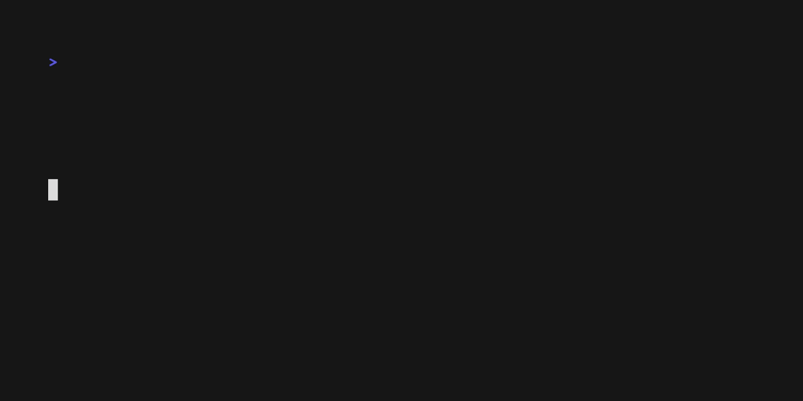
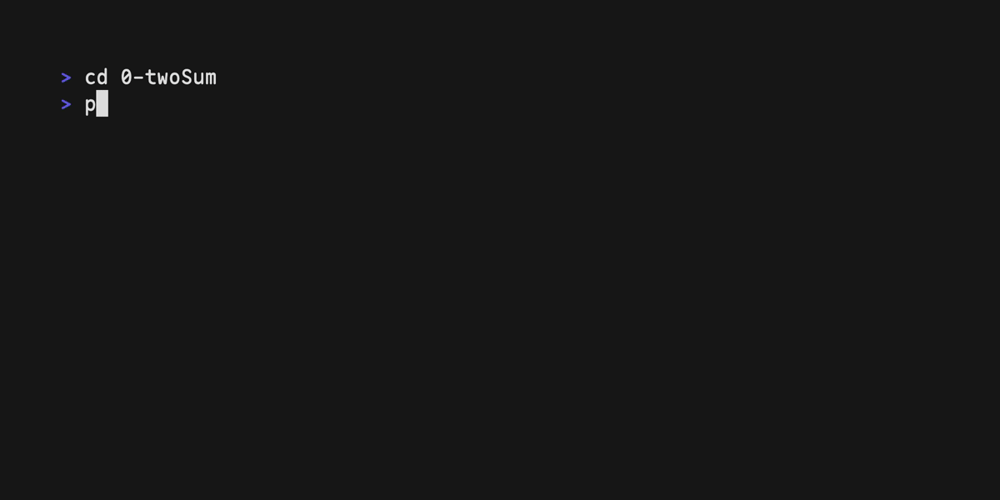

# Local Judge

This is a simple judge for creating problem set and testing them locally. It is not intended to be used in production.

## Installation

Install the dependencies:

```sh
$ pip install -r requirements.txt
```

## Usage

You can check out the help message by running `python3 make.py -h`:

```sh
usage: make.py [-h] [--index INDEX] [--template TEMPLATE] [--compiler COMPILER] [--source SOURCE] [--standard STANDARD] [--repeat REPEAT] name

positional arguments:
  name                 Name of the problem

options:
  -h, --help           show this help message and exit
  --index INDEX        Manual index of the problem
  --template TEMPLATE  Template directory of the problem
  --compiler COMPILER  Compiler to compile the source code
  --source SOURCE      Source code of the solution to the problem
  --standard STANDARD  C++ standard to compile the source code
  --repeat REPEAT      Number of times to repeat the test
```

### Create a problem named _twoSum_

```sh
$ python3 make.py twoSum
```

This will create a directory named _twoSum_ with the following structure:



```sh
0-twoSum/
├── data/
├── results/
├── config.py
├── generate_data.py
├── README.md
├── solution.cpp
└── test.py
```

Note that the index number is automatically generated. You can manually assign one using the `--index` option.

Each problem has a `config.py` file, which contains the following fields:

```python
cpp_compiler = "g++"
cpp_file_name = "solution.cpp"
cpp_standard = "c++17"
test_repeat = 10
```

- `cpp_compiler` is the compiler to use for the compilation.
- `cpp_file_name` is the name of the solution file.
- `cpp_standard` is the standard of the solution file.
- `test_repeat` is the number of times to repeat the test (for better accuracy in time measurement).

These fields can be modified to fit your needs, using the `--compiler`, `--source`, `--standard` and `--repeat` options accordingly.

`generate_data.py` is used to generate test data. You can modify it to generate different test data according to problem description in `README.md`.


`solution.cpp` is to be filled with your solution to the problem. And `test.py` is used to test your solution.

### Test your solution

```sh
$ cd 0-twoSum && python3 test.py
```

This will compile your solution and run it against the test cases. The results will be stored in `results/`. If the result is incorrect, the logger will print an error message.



## Roadmap

- [ ] Add memory usage measurement
- [ ] Add support for multiple solutions
- [ ] Add support for different languages

## Contributing

Pull requests are welcome. For major changes, please open an issue first to discuss what you would like to change, and I will see if I can provide with any help.
